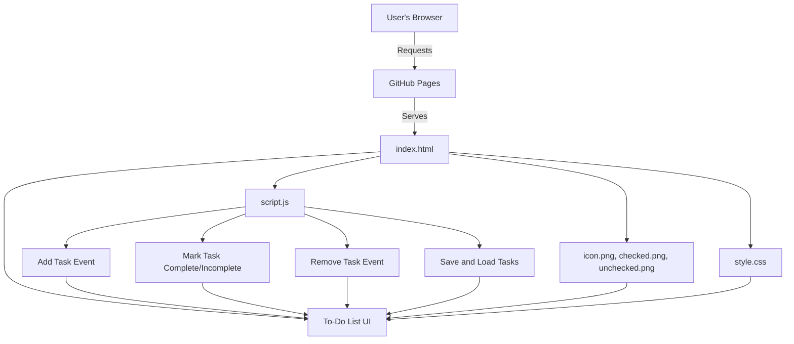

# 📝 To-Do List Web App

A simple, beautiful, and responsive **To-Do List** app built with **HTML**, **CSS**, and **JavaScript**. Easily add, complete, and remove tasks with a modern UI and intuitive interactions. All tasks are stored locally in your browser—no backend, no account required!

[**🌐 Live Demo → sinha-19.github.io/To-Do-List/**](https://sinha-19.github.io/To-Do-List/)

---

## 🗺️ Workflow Diagram



---

## 📁 Project Structure

```
To-Do-List/
├── index.html           # Main HTML file for the To-Do List UI
├── style.css            # Styles for layout, colors, fonts, and responsiveness
├── script.js            # All interactivity and local storage logic
├── icon.png             # App favicon/icon
├── checked.png          # Checkbox for completed task
├── unchecked.png        # Checkbox for incomplete task
├── images/              # (Optional) Folder for additional images
├── .vscode/             # (Optional) VSCode settings
```

---

## ✨ Features

- **Add Tasks:**  
  Quickly add new tasks by typing and pressing Enter or clicking the add button.
- **Mark Complete/Incomplete:**  
  Click the checkbox to toggle a task's status, with visual feedback (`checked.png` & `unchecked.png`).
- **Delete Tasks:**  
  Remove unwanted tasks instantly.
- **Persistent Storage:**  
  All tasks are automatically saved in your browser's `localStorage`. Refreshing the page keeps your list intact!
- **Responsive Design:**  
  Works and looks great on desktop, tablet, and mobile devices.
- **Modern UI:**  
  Clean layout, smooth transitions, and intuitive icons.
- **No Dependencies:**  
  100% vanilla JavaScript, CSS, and HTML.

---

## 📝 How It Works

- **index.html**  
  - Contains the main structure: header, input field, add button, and the task list.
  - References all styles, icons, and the JavaScript file.

- **style.css**  
  - Handles all styling, including layout, colors, fonts, hover effects, and responsive design.

- **script.js**  
  - Adds new tasks to the list.
  - Handles marking tasks as complete/incomplete using custom checkboxes.
  - Enables deleting tasks with one click.
  - Saves and loads tasks from `localStorage` for persistence.

- **icon.png, checked.png, unchecked.png**  
  - Used for app favicon and for displaying task completion status.

---

## 🌐 Live Demo

> **Try the To-Do List now:**  
> [https://sinha-19.github.io/To-Do-List/](https://sinha-19.github.io/To-Do-List/)

---

## 🖼️ Assets Overview

| File         | Description                      |
|--------------|----------------------------------|
| icon.png     | App favicon/icon                 |
| checked.png  | Checkbox for completed task      |
| unchecked.png| Checkbox for incomplete task     |
| images/      | (Optional) Extra images folder   |

---

## 🚀 Getting Started (Local Development)

1. **Clone the repository:**
   ```bash
   git clone https://github.com/sinha-19/To-Do-List.git
   cd To-Do-List
   ```

2. **Open `index.html` in your browser:**
   - Double-click the file  
     **OR**
   - Use a simple local server:
     ```bash
     npx serve .
     # or
     python -m http.server
     ```

---

## 🛠️ Customization Tips

- **Change Theme or Fonts:**  
  Modify colors and fonts in `style.css`.
- **Add More Features:**  
  Extend `script.js` (e.g., task due dates, categories, drag-and-drop).
- **Swap Icons:**  
  Replace `checked.png` and `unchecked.png` for a fresh look.
- **Reorganize Layout:**  
  Edit `index.html` and `style.css` to suit your needs.

---

## 💡 Credits

- **Design & Code:** [Saket Kumar Sinha](https://github.com/sinha-19)
- **Icons & Images:** Included for demo purposes.

---

## 📝 License

Open-source and free to use for learning or personal projects.

---

> _A beautiful, simple to-do list—built with pure web technologies!_
